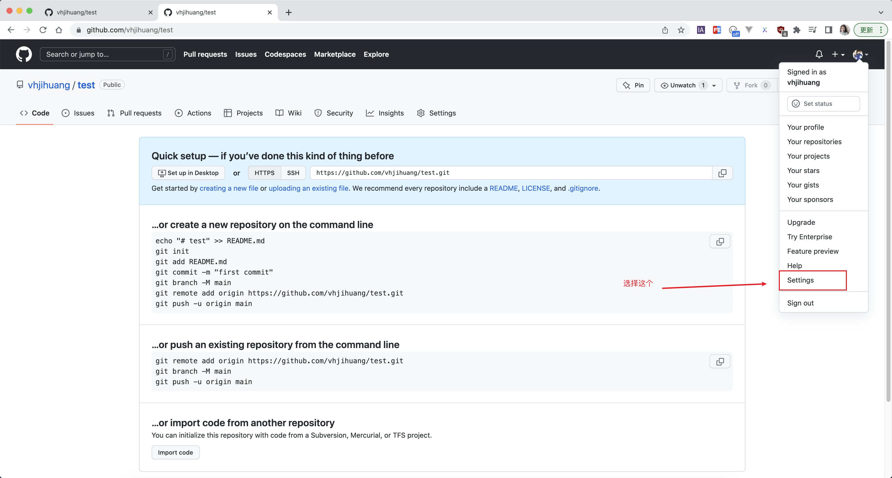

### 如何用vuepress搭建博客
  1. 提示: 我用的是`mac`电脑,此文章编辑时间是2022年12月17日,目前`vuepress`及依赖和软件还在更新,搭建步骤仅供参考.
  2. 搭建博客时软件的版本
      1. `node`版本: `v18.12.0`.
      2. `pnpm`版本: `7.18.1`.
      3. `vuepress`版本: `2.0.0-beta.59`.
      4. `git`版本:`2.38.2`.
  3. 搭建博客的步骤本质上只有三部分
      1. 远程仓库的创建,及生成自动化部署需要的`token`.(`ps`:我不知道之前生成的`token`可不可以复用,没有试验过)
      2. 本地仓库的初始化,本地仓库连接远程仓库,并且上传本地代码
      3. 在远程仓库添加自动化部署文件
  4. 总结
      1. 在搭建的过程中,所有报的一切错都是上述3部分中的某一部分,仔细分辨,逐个解决,实在不行从头再来是个好方法.下面的步骤不是只有按照我写的才能完成,有些步骤不一定按照我的写法也是可以的.比如: 创建好仓库后获取仓库地址,然后就可以直接在本地使用`git clone 仓库地址`克隆到本地,就不需要手动连接到远程仓库
      2. 搭建过程可能遇到的问题,依赖版本不对,工具版本不对,本地仓库的分支不对,配置文件不对,配置文件和部署文件配置没对上等很多问题.
### 实现步骤

  1. 远程仓库部分
      1. 创建仓库
          1. 仓库名称和你的`config.js`内的`base`要一致,规则是源自`vuepress`官方文档**部署模块**.

          

      2. 生成`Personal access tokens (classic)`
          1. 鼠标点击头像出现菜单,选择 `Settings` -> 选择左边菜单下的 `Developer settings`.

          
          

          2. 左边菜单选择 `Personal access tokens` -> 选择 `Tokens(classic)` -> 点击`Generate new token` -> 选择 `Generate new token (classic)`.

          
          

          3. 在页面输入`token`名称 -> 选择 `Expiration` 时间 (过期后需要更新,选`no Expiration`永远不过期,存在安全隐患) -> 勾选`repo`和`workflow` -> 拉到底部点击 `Generate token` -> 生成 `Personal access tokens` -> 复制保存`token`.

          
          

      3. 在项目中设置`token`
          1. 进入代码空间,选择 `Settings` -> 选择左边菜单的 `Secrets` -> 选择`Actions` ->  点击`New repository secret` -> 输入 `token` 名称,把生成的`token`粘贴到`secret`输入框内.

          
          

  2. 本地仓库部分

      [vuepress文档](https://v2.vuepress.vuejs.org/zh/guide/getting-started.html)
      1. 创建文件并且进入文件内
          ```sh
          mkdir test && cd test
          ```
      2. 初始化文件
          ```sh
          git init 
          pnpm init
          ```
      3. 下载依赖
          ```sh
          pnpm add -D vuepress@next @vuepress/client@next vue
          ```
          
      4. 添加过滤文件
          
          ```sh
          echo 'node_modules' >> .gitignore
          echo '.temp' >> .gitignore
          echo '.cache' >> .gitignore
          ```
      5. 添加运行和打包指令

          
          ```json
          {
            "scripts": {
              "dev": "vuepress dev docs",
              "build": "vuepress build docs"
            }
          }
          ```
      6. 运行项目

          
          ```sh
          pnpm dev
          ```
      7. 添加配置文件
          1. 添加`config.js`配置文件,并添加以下代码

          
          ```js 
          import { defineUserConfig } from 'vuepress'

          export default defineUserConfig({
            lang: 'zh-CN',
            title: 'Welcome My test',
            description: 'Welcome My test',
            base: '/test/',
            markdown: {
              code: {
                lineNumbers: false
              }
            }
          })
          ```
      8. 连接仓库和上传文件

          
          ```sh
          git remote add origin https://github.com/vhjihuang/test.git  // 此处改为自己的仓库地址
          git branch -M main
          git add ./
          git commit -m'初始化项目'
          git push -u origin main
          ```
  3. 添加自动化部署文件
      1. 进入代码空间,选择`Actions` -> 点击左边的`New workflow` -> 点击`Configure` -> 从`vuepress`文档复制的工作流文件粘贴进去 -> 点击右边的`Start commit` -> 点击`commit new file`

          1. 打开相应的页面

              
          2. 添加部署文件和添加部署代码

              
              ```yml
              name: docs

              on:
                # 每当 push 到 main 分支时触发部署
                push:
                  branches: [main]
                # 手动触发部署
                workflow_dispatch:

              jobs:
                docs:
                  runs-on: ubuntu-latest

                  steps:
                    - uses: actions/checkout@v3
                      with:
                        # “最近更新时间” 等 git 日志相关信息，需要拉取全部提交记录
                        fetch-depth: 0

                    - name: Setup pnpm
                      uses: pnpm/action-setup@v2
                      with:
                        # 选择要使用的 pnpm 版本
                        version: 7
                        # 使用 pnpm 安装依赖
                        run_install: true

                    - name: Setup Node.js
                      uses: actions/setup-node@v3
                      with:
                        # 选择要使用的 node 版本
                        node-version: 18
                        # 缓存 pnpm 依赖
                        cache: pnpm

                    # 运行构建脚本
                    - name: Build VuePress site
                      run: pnpm build

                    # 查看 workflow 的文档来获取更多信息
                    # @see https://github.com/crazy-max/ghaction-github-pages
                    - name: Deploy to GitHub Pages
                      uses: crazy-max/ghaction-github-pages@v2
                      with:
                        # 部署到 gh-pages 分支
                        target_branch: gh-pages
                        # 部署目录为 VuePress 的默认输出目录
                        build_dir: docs/.vuepress/dist
                      env:
                        # @see https://docs.github.com/cn/actions/reference/authentication-in-a-workflow#about-the-github_token-secret
                        GITHUB_TOKEN: ${{ secrets.TEST_TOKEN }}

              ```
          3. 部署成功之后,你本地改完代码,提交到远程仓库后会自动更新你的博客.

  **后续**: 你们可能发现了,我没有配置菜单部分和插件之类的,实际上我对于菜单配置和插件配置有些没弄懂,所以呢,我就没有配置,但是这些配置可以在项目成功上线并且自动化部署后添加上去的,菜单配置之类的可以自己琢磨配置上去,也可以参考其他网友的,或者看官方文档也可以的.

  
